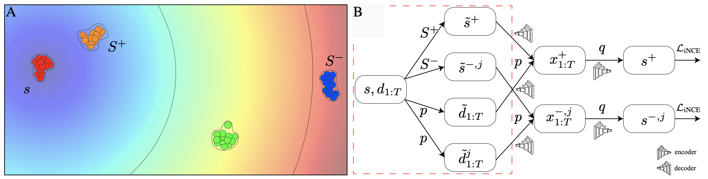

# Sample and Predict Your Latent: Modality-free Sequential Disentanglement via Contrastive Estimation (SPYL)

## Overview
We introduce a self-supervised sequential disentanglement framework based on contrastive estimation with no external
signals, while using common batch sizes and samples from the latent space itself.
In practice, we propose a unified, efficient, and easy-to-code sampling strategy for semantically similar
and dissimilar views of the data. We evaluate our approach on video, audio, and time series benchmarks.
Our method presents state-of-the-art results in comparison to existing techniques.

<div align=center></div>

In the above figures, we show the essence of SPYL method.
In the left figure (A), we show how to generate positive and negative static views of static content ($s$),
we collect the closest S^+$ and farthest $S^-$ distributions in the batch.
We sample from these distributions using the reparameterization trick.
The scheme is the same for sampling dynamic content ($d$)
In the right figure (B), we show how we use our predictive sampling trick,
generating samples by using the posterior of the sampled prior.

## Training

In the repository, you can find a training code of a new model on the sprites dataset. The sprites dataset can be found 
on a third-party [repo](https://github.com/YingzhenLi/Sprites). 
To run the training process just run the next command:
```
python train.py
```

## Experiments

In the swaps experiment file, you can find two experiments related to swap using our method.
The first one, is a quantitative experiment that evaluate the generation and swapping performance of the model.
This experiment was displayed in the quantitative experiment on the paper.
The second experiment, is a display of a swap. You can run both experiment using running the next simple command:
```
python ./swaps_experiments.py
```

### Pre Trained Model: 
To run the experiment, you need either train you own model or download and use a pretrained model from the Drive:
```
https://drive.google.com/drive/u/1/folders/1Q072qp1hn2WDsDXG0XCmXmAwuNasJ8Yy
```
Download the file and locate it into  '"./weights/model.pth"' 


## Paper
```
@inproceedings
{naiman23sample,
author={Ilan Naiman and Nimrod Berman and Omri Azencot},
title={Sample and Predict Your Latent: Modality-free Sequential Disentanglement via Contrastive Estimation},
booktitle={International Conference on Machine Learning},
pages={25694--25717},
publisher={{PMLR}},
year={2023},
url={https://proceedings.mlr.press/v202/naiman23a.html}
}
```
